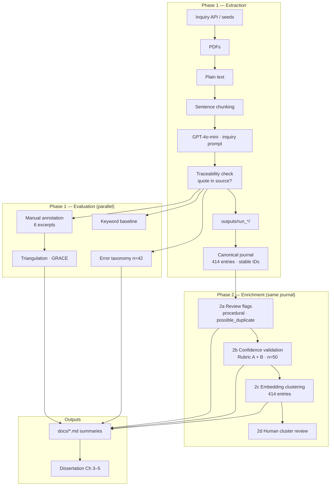
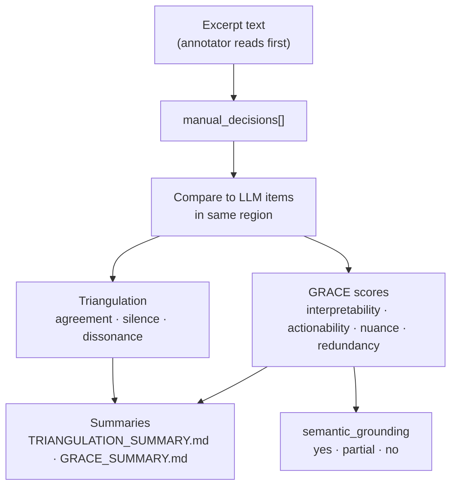

# System architecture and artefacts

**Contribution:** A reproducible method and evaluation framework for LLM-based decision extraction from inquiry transcripts, with error taxonomy and baseline comparison — not a deployed system.

**What you built (one sentence):** A CLI research pipeline that turns UK COVID-19 Inquiry PDFs into traceable decision-journal JSON (LLM extraction + automated quote checks), plus a manual evaluation layer (triangulation, GRACE, baseline, error taxonomy).

**Not built:** web app, RAG query system, fine-tuned model.

---

## Architecture (high level)

Phase 1 produces a **frozen canonical journal**. Phase 2 **enriches the same artefact** — flags, confidence validation, clustering — without re-running extraction.



**Hierarchy (non-negotiable):** traceability is the auditable floor → review flags mark caution → confidence is tested (not self-reported) → clustering is interpretation → human judgement is final.

**Design choice:** Grounding is **in-prompt** (each chunk is the context window) plus mandatory `source_quote`, not a separate retrieval index like RAG.

### End-to-end sequence (text)

```
Transcript (PDF)
  → Extraction (LLM + chunking)
  → Traceability validation
  → Canonical journal (414, frozen)
  → Review flags (2a — no deletions)
  → Confidence validation (2b — human Rubric A/B, then rule/LLM compare)
  → Clustering (2c — embeddings + HDBSCAN)
  → Human cluster label review (2d)
```

---

## Pipeline stages

| Stage | Script | Input | Output |
|-------|--------|-------|--------|
| **Harvest** | `scripts/run_pipeline.py --stage harvest` | Inquiry API + `configs/inquiry_phase1_seeds.json` | `data/manifests/inquiry_module2_phase1.csv` |
| **Download** | `scripts/run_pipeline.py --stage download` | Manifest CSV + PDF URLs | `data/raw/inquiry/{document\|report}/*.pdf` |
| **Text** | `scripts/run_pipeline.py --stage text` | PDFs | `data/processed/inquiry/**/*.txt` |
| **Extract** | `scripts/run_extraction.py [--inquiry]` | `.txt` (or `.docx`) file | `outputs/run_<timestamp>_<label>/` |
| **Verify data** | `scripts/verify_phase1_data.py` | Manifest + disk paths | Console pass/fail |
| **Build excerpts** | `scripts/build_annotation_excerpts.py` | Transcripts + LLM runs | `configs/annotations/manual_phase1.json` (shell) |
| **Summarise eval** | `summarize_triangulation.py`, `summarize_grace.py` | Workbook JSON | `docs/TRIANGULATION_SUMMARY.md`, `docs/GRACE_SUMMARY.md` |
| **Baseline** | `scripts/keyword_baseline.py` | Manual + LLM JSON | `docs/BASELINE_KEYWORD.md` |
| **Error taxonomy** | `scripts/build_error_taxonomy.py` | All inquiry runs | `docs/ERROR_TAXONOMY.md`, `configs/evaluation/error_taxonomy_sample.json` |
| **Canonical journal** | `scripts/build_phase1_journal.py` | 8 canonical runs in `configs/phase1_journal_runs.json` | `data/manifests/phase1_decision_journal.json` |
| **Review flags (2a)** | `scripts/apply_review_flags.py` | Canonical journal | Journal updated in place (`phase2.review_flags`) |
| **Validation sample (2b)** | `scripts/build_confidence_validation_sample.py` | Canonical journal | `configs/evaluation/confidence_validation_sample.json` |
| **Human rating (2b)** | `scripts/rate_confidence_sample.py [--checklist]` | Validation sample | Ratings saved to sample manifest |
| **Benchmark** | `scripts/run_benchmark.py` | Synthetic test cases | Console / benchmark output |

**Core library:** `src/decision_journal/` — `extraction.py` (prompts, chunking, traceability), `journal.py` (load canonical journal), `review_flags.py` (Phase 2a rules), `inquiry_harvest.py`, `inquiry_download.py`, `inquiry_batch_text.py`, `pdf_text.py`.

---

## Reproducibility (model and configs)

- **Model:** All Phase 1 extractions recorded as `gpt-4o-mini` in each run's `manifest.json` (default via `OPENAI_MODEL` in `.env`).
- **Chunking:** 7 sentences, overlap 2 (set in `run_extraction.py`; stored per run in manifest).
- **Prompts and seeds** archived in `src/decision_journal/extraction.py` and `configs/`.
- **Re-run note:** OpenAI may route `gpt-4o-mini` to a dated snapshot; pin e.g. `gpt-4o-mini-2024-07-18` in `.env` if exact replication is required.

---

## Inputs

| Input | Location | Notes |
|-------|----------|-------|
| Inquiry PDFs | `data/raw/inquiry/` (downloaded) | 8 hearing transcripts + 1 In Brief report (pilot) |
| Processed text | `data/processed/inquiry/` | PDF→text, inquiry-aware cleanup (`clean_inquiry_text`) |
| Manifest | `data/manifests/inquiry_module2_phase1.csv` | Phase 1 row selection |
| Corpus config | `configs/inquiry_corpus.json` | Module / document-type filters |
| OpenAI API | `.env` → `OPENAI_API_KEY`, `OPENAI_MODEL` | Chunked API calls |
| Prompt + schema | `src/decision_journal/extraction.py` | Default vs `--inquiry` (stricter) prompt |
| Manual labels | `configs/annotations/manual_phase1.json` | Author: Akeeb Lawal |

---

## Outputs (decision journal schema)

Each extracted **decision** is one JSON object:

```json
{
  "decision": "On 18 March 2020, COBR decided to close schools from 20 March.",
  "evidence": "Counsel states COBR's decision directly in questioning.",
  "source_location": "sentence_2",
  "source_quote": "On the 18th, COBR decided to close schools from the 20th",
  "traceability_ok": true
}
```

Per **extraction run** (`outputs/run_*`):

| File | Contents |
|------|----------|
| `manifest.json` | Input path, model, chunk settings, decision count, traceability pass/fail list |
| `decisions.json` | All merged, deduped decisions |
| `raw_llm_outputs.json` | Raw LLM JSON per chunk (audit trail) |

**Corpus scale (Phase 1):**

| Corpus | Runs | Decisions | Traceability |
|--------|------|-----------|--------------|
| 8 transcripts (`--inquiry`) | 8 | 414 | 351/414 (**84.8%**) |
| 1 In Brief report (pilot) | 1 | 53 | 50/53 (**94%**) |

Per-hearing traceability ranges **78%** (23 May 2024) to **91%** (28 Nov 2023). Failures are recorded in each run's `manifest.json` as `source_quote_not_found_in_text` (majority) or occasional `bad_source_location`. These are primarily **mechanical** — the LLM returned a quote, but exact or fuzzy matching against processed text failed — not silent hallucination without a quote field.

**Why traceability fails:** Inquiry PDFs convert to text with line-break and spacing artefacts (page headers, column numbers, hyphenation). The pipeline uses alphanumeric folding for fuzzy match (`normalize_for_quote_match` in `extraction.py`), which recovers many cases; remaining failures are often long quotes spanning PDF layout glitches. Manual triangulation showed semantic agreement can hold even when `traceability_ok` is false (e.g. excerpt_002, LLM item 31).

Details: [`INQUIRY_EXTRACTION_SUMMARY.md`](INQUIRY_EXTRACTION_SUMMARY.md) · [`REPORT_PILOT.md`](REPORT_PILOT.md).

### Canonical Phase 1 journal (frozen artefact)

Phase 2 reads **one file**, not scattered `outputs/run_*` folders:

| Field | Location |
|-------|----------|
| Committed journal | `data/manifests/phase1_decision_journal.json` |
| Run list (explicit, no glob) | `configs/phase1_journal_runs.json` |
| Build script | `scripts/build_phase1_journal.py` |

Envelope: `artifact_type: canonical_decision_journal`, `journal_version: phase1`, totals **414 / 351 / 63**. Each entry has stable `id` (`phase1-001` … `phase1-414`), `hearing_date`, provenance (`run_id`, `item_index`), and `phase2` fields for enrichment.

### Phase 2 enrichment (same artefact)

Phase 2 does **not** re-extract. It annotates the canonical journal:

| Step | Script | Status (Jun 2026) | Output |
|------|--------|---------------------|--------|
| **2a Review flags** | `apply_review_flags.py` | **Done** — 36/414 flagged (4 `procedural`, 32 `possible_duplicate`) | `phase2.review_flags` on journal |
| **2b Human validation** | `rate_confidence_sample.py` | **Done** — 50/50 rated; alignment pass 22 May 2026 | `configs/evaluation/confidence_validation_sample.json` |
| **2b Confidence compare** | `compare_confidence_signals.py` | **Done** — rule κ≈0.48, LLM κ≈0.39 vs Rubric B | `configs/evaluation/confidence_comparison_results.json` |
| **2b Discourse pilot** | `classify_discourse.py --validate` | **Done** — exploratory n=50 tags (not production) | `configs/evaluation/confidence_validation_discourse_pilot.json` |
| **2c Clustering** | `run_clustering.py` | **Done** — agglomerative + OpenAI embeddings; 20 themes | journal v1.2 `phase2.cluster_id`, `cluster_label` |
| **2c Figures** | `visualize_clustering.py` | **Done** | `outputs/figures/phase1_cluster_*.png` |
| **2d Cluster review** | Human + supervisor | **Pending** | Approve labels in `phase1_clustering_report.json` |

**Phase 2b rubrics (locked):**

| Rubric | Question | Values |
|--------|----------|--------|
| **A** | Valid decision journal entry? (domain judgement) | yes / no / unclear |
| **B** | Strength of support? (evidence only — quote → decision) | high / medium / low |

Checklist for Rubric B: (1) quote readable? + (2) quote supports decision? → 0/2=low, 1/2=medium, 2/2=high.

**Four-quadrant interpretation (thesis figure):**

| A | B | Meaning |
|---|---|---------|
| Yes | High | Strong journal entries |
| Yes | Low | Decision-like but weakly evidenced |
| No | High | Correct extraction, wrong artefact type |
| No | Low | Noise |

Details: [`MEETING_4_ISSUES_AND_TODOS.md`](MEETING_4_ISSUES_AND_TODOS.md) §B.1.

---

## Evaluation artefacts

| Artefact | Path | What it contains |
|----------|------|------------------|
| Annotation workbook | `configs/annotations/manual_phase1.json` | **6 excerpts** fully annotated (triangulation, GRACE) |
| Triangulation summary | `docs/TRIANGULATION_SUMMARY.md` | 5 agreement / 10 silence / 0 dissonance (15 comparisons) |
| Corpus extraction summary | `docs/INQUIRY_EXTRACTION_SUMMARY.md` | Per-transcript run stats (8 hearings) |
| Keyword baseline | `docs/BASELINE_KEYWORD.md` | LLM recall 83% vs keyword 17% vs manual (5/6 vs 1/6) |
| Error taxonomy | `docs/ERROR_TAXONOMY.md` + `configs/evaluation/error_taxonomy_sample.json` | **42 cases** (9 author-validated + 33 heuristic) |
| GRACE summary | `docs/GRACE_SUMMARY.md` | **n = 16** (7 agreement/TP-style · 9 false-positive / silence LLM-only) |
| Report pilot | `docs/REPORT_PILOT.md` | Second document genre |
| Phase 2 validation sample | `configs/evaluation/confidence_validation_sample.json` | n=50 stratified sample for Rubric A/B rating |
| Synthetic benchmark | `scripts/run_benchmark.py` | 5 controlled test cases |

### Evaluation scale (do not conflate)

1. **Triangulation (primary manual eval):** 6 excerpts · 6 manual decisions · 15 LLM–manual comparisons · MATA-style agreement / silence / dissonance.
2. **Error taxonomy (extended sample):** 42 items = **9 author-validated** false positives from triangulation silence rows + **33 heuristic-classified** samples from the full inquiry corpus.
3. **GRACE quality scores:** n = 16 scored LLM items (workbook + `configs/evaluation/grace_expansion.json`).

**Heuristic taxonomy sampling (n = 33):** Stratified random sample (seed = 42) from all inquiry-mode extractions, excluding the 9 validated items. ~**70%** from items flagged as likely false positives by the heuristic classifier; ~**30%** from likely true positives / borderline. See `scripts/build_error_taxonomy.py`.

**Manual excerpt representativeness:** 6 excerpts span **3 hearing days** (28 Nov, 30 Nov, 1 Dec 2023) and **2 witness roles** (Michael Gove — Cabinet Office; Matt Hancock — former Health Secretary). Mix includes COBR/COVID-O decisions, traceability pass/fail, and silence-only advocacy excerpts.

---

## Manual evaluation flow



Text sequence:

```
Excerpt text (annotator reads first)
  → manual_decisions[]
  → compare to LLM items in same region
  → triangulation: agreement | silence | dissonance
  → GRACE scores on LLM items (interpretability, actionability, nuance, redundancy)
  → semantic_grounding: yes | partial | no
```

Scripts: `build_annotation_excerpts.py` · `summarize_triangulation.py` · `summarize_grace.py`

Protocol: [`ANNOTATION_RUBRIC.md`](ANNOTATION_RUBRIC.md) · [`ANNOTATION_SESSION_NOTES.md`](ANNOTATION_SESSION_NOTES.md)

---

## Repository layout

```
code/
├── src/decision_journal/     # Core extraction + inquiry ingest
├── scripts/                  # CLI entry points
├── configs/
│   ├── annotations/          # manual_phase1.json workbook
│   └── evaluation/           # error_taxonomy_sample.json, grace_expansion.json
├── data/
│   ├── manifests/            # inquiry_module2_phase1.csv (committed)
│   ├── raw/inquiry/          # PDFs (gitignored)
│   └── processed/inquiry/    # Text (gitignored)
├── outputs/run_*/            # Extraction runs (gitignored)
├── docs/                     # Summaries, briefs, this file
└── dissertation/             # Writing, interim review
```

---

## Operational notes (latency and cost)

Phase 1 **did not log** per-chunk latency or token usage. Each run's `manifest.json` records **`chunk_count`** (API calls per file).

| Metric | Phase 1 value | Notes |
|--------|---------------|-------|
| Chunk API calls (8 transcripts) | **1,230** | Sum of per-run chunk counts in [`INQUIRY_EXTRACTION_SUMMARY.md`](INQUIRY_EXTRACTION_SUMMARY.md) |
| Chunk API calls (In Brief report) | 22 | Report pilot run |
| Latency | Not recorded | Sequential chunk loop; dominated by network + model time |
| Token / cost | Not recorded | Future improvement: persist `usage` from OpenAI response in manifest |

Order-of-magnitude: ~1,250 short-context calls on gpt-4o-mini — feasible for a one-off research corpus; not optimised for production throughput.

---

## Prototype scope

| Component | Status |
|-----------|--------|
| Decision journal data model | JSON schema with provenance fields |
| Extraction engine | Python + OpenAI, chunking, dedupe, traceability |
| Data pipeline | Harvest → PDF → text → extract |
| Canonical journal artefact | 414 entries, stable IDs, committed manifest |
| Phase 2a review flags | Procedural + duplicate flags; no row deletion |
| Phase 2b confidence validation | Complete — 50/50 human rating; signal comparison; discourse pilot |
| Phase 2c clustering | Complete — 20 themes; agglomerative (HDBSCAN deferred) |
| Phase 2d cluster labels | Pending supervisor review |
| Evaluation harness | Workbook + summary scripts + baseline + taxonomy |
| User interface | None — CLI + markdown reports (supervisor Q1: UI optional) |

---

## Examiner / viva prep (short answers)

| Question | Answer |
|----------|--------|
| Why 6 excerpts? | Supervisor methodology: small manual sample for depth; broader LLM run (414 decisions) + taxonomy/baseline for scale. |
| How representative? | Purposive sample: 3 days, 2 witness types, mix of agreement/silence/traceability outcomes — not population inference. |
| Why ~85% traceability, not 100%? | Mostly **PDF→text artefacts** breaking exact quote match (`source_quote_not_found_in_text`). Fuzzy alphanumeric matching recovers many; failures are mechanical validation, not missing quote fields. Semantic content can still agree (see excerpt_002). |
| Why 78% on 23 May? | Lowest per-hearing pass rate in the corpus; same failure mode (layout/spacing in processed text). Worth spot-checking content separately — low traceability ≠ necessarily wrong extraction. |
| Why not RAG? | Chunk-in-prompt + mandatory quotes is simpler and auditable at this corpus size. |
| Why not a smaller/open model? | Future work / ablation; gpt-4o-mini chosen for cost and JSON reliability in Phase 1. |
| Statistical testing? | Descriptive proportions and MATA-style counts; appropriate for qualitative manual coding at this n. |
| Is CLI enough? | Yes for CS/AI research MSc; contribution is method + evaluation, not deployment. |

---

## Related docs

- **Visual storyboard (v1):** [`PIPELINE_STORYBOARD.html`](PIPELINE_STORYBOARD.html) — open in browser; screenshot for meeting/dissertation
- **Visual storyboard (v2, governed):** [`PIPELINE_STORYBOARD_GOVERNED.html`](PIPELINE_STORYBOARD_GOVERNED.html) — dissertation figure; GenAI-once framing
- Meeting brief: [`SUPERVISOR_BRIEF_2026-06-17.md`](SUPERVISOR_BRIEF_2026-06-17.md)
- Progress log: [`PROGRESS.md`](PROGRESS.md)
- Triangulation: [`TRIANGULATION_SUMMARY.md`](TRIANGULATION_SUMMARY.md)
