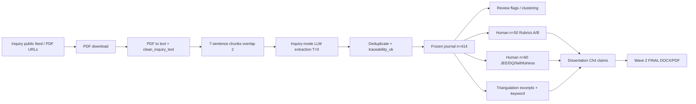

# Data lineage — public source to findings

## Stage notes

| Stage | Authoritative artefact | Class |
| --- | --- | --- |
| Source manifests | `data/manifests/inquiry_module2_phase1.{csv,json}` | 2 / 4 |
| Cleaning / chunking code | `src/decision_journal/extraction.py`, `pdf_text.py` | 1 |
| Prompt | `INQUIRY_PROMPT_TEMPLATE` in `extraction.py` | 4 when applied historically |
| Per-hearing runs | `outputs/run_*` (local; untracked) → merged | 4 |
| Fixed journal | `data/manifests/phase1_decision_journal.json` | 4 / 1 inspect |
| Traceability | `validate_traceability` fields on journal | 1 |
| Human eval | excerpts; n=50 JSON; Audit E + consistency CSV | 5 |
| Dissertation | markdown + Wave 2 package | 1 / 6 |

## Untracked trees (not copied into Git)

| Tree | Treatment |
| --- | --- |
| `data/raw/inquiry/**` PDFs | Publicly recoverable via `pdf_url` in tracked manifest; local path historical only |
| `data/processed/inquiry/**` txt | Regenerable from PDFs + `clean_inquiry_text`; not tracked |
| `outputs/run_<stamp>_*/` | Hash-protect locally when present; dissertation numbers come from **journal**, not re-run |

Minimal demo snapshots under `outputs/distinction_strategy/03_reproducibility_package/demos/` cite journal fields + run id + public URL + optional local run SHA — they do **not** embed full transcripts.
